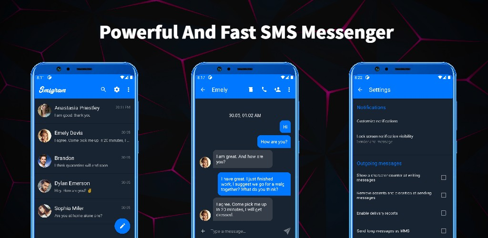

<p align="left">
    <a href="https://github.com/favrora/Avatar-Maker/stargazers">
      
    </a>
    
    
    
</p>

# Smsgram

Powerful and fast Smsgram Messenger. A super user-friendly interface similar to Telegram will make your communication via SMS enjoyable. The design of the application is very convenient and implemented like most messengers.

*Give a star to the repository, it will help us grow! Thanks!*

<a href="https://www.producthunt.com/posts/smsgram?utm_source=badge-featured&utm_medium=badge&utm_souce=badge-smsgram" target="_blank"></a>

## Demo

Link to app on Google Play: [Mobile app](https://play.google.com/store/apps/details?id=com.favrora.avatar)

## Preview



## Development

Getting Start:
* Copy the project with this command:

    ```sh
    $ git clone https://github.com/favrora/smsgram.git
    ```

* To build the application you need an additional library com.favrora.commons. [Link to the library here](https://github.com/favrora/SMS-commons)
* Build gradle and apk file


